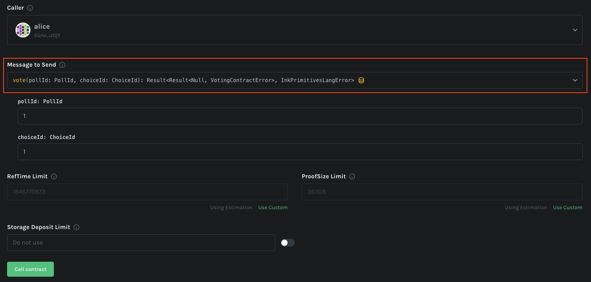

# Voting DApp

This repository contains code for a voting smart contract that allows users to create a poll and vote on it. The smart
contract is written using (ink!)[https://use.ink/]. **ink!** smart contracts are written in
(Rust)[https://www.rust-lang.org/] and are compiled to WebAssembly before being deployed on the blockchain.

## Getting Started

### Prerequisites

Before you can run the smart contract, you need to install all the prerequisites for running substrate. You can find the
detailed instructions for installing the prerequisites [here](https://docs.substrate.io/install/).

In addition to the substrate prerequisites, you also need to install ink! CLI. You can find the detailed instructions
[here](https://github.com/paritytech/cargo-contract#installation).

For building and running different components, you need to install the
[just](https://just.systems/man/en/chapter_4.html) and [jql](https://github.com/yamafaktory/jql#-installation).

> Note that **just** and **jql** are not required for running the dapp. You can alternatively run the individual
commands manually. However, **just** and **jql** make it easier to run these commands.

### Building

To build all the components, run the following command:

```bash
just build
```

> Note that this might take some time if you're building the substrate node for the first time.

### Testing

To run the tests for all the components, run the following command:

```bash
just test
```

### Running

To run a local substrate node, run the following command:

```bash
just run-substrate-node
```

In a separate terminal, run the following command to deploy the smart contract on the local substrate node:

```bash
just deploy-voting-contract
```

#### Troubleshooting

If you get an error while deploying the smart contract, try purging the local substrate node before deploying the smart
contract:

```bash
just purge-substrate-node
```

### Upgrading

Voting smart contract intentionally introduces a bug where it does not compute the winner of a poll. This bug is fixed
in the upgraded version of voting smart contract (to demonstrate the upgrade functionality).

To upgrade the smart contract, run the following command:

```bash
just upgrade-voting-contract
```

Once the smart contract is upgraded, it should correctly report the winners of all the future polls.

### Usage

After running the node and deploying the smart contract, you can interact with the smart contract using
[https://contracts-ui.substrate.io/](https://contracts-ui.substrate.io/).

To add the smart contract to `Contracts UI`, select the `Add New Contract` tab and `Use On-Chain Contract Address`
option on Contracts UI.

> Note that Contracts UI, sometimes, does not register keyboard inputs on ID fields (e.g. poll ID, choice ID, etc.). The
  ID fields can be changed using up and down arrow keys. 


Next, copy the deployed contract address from `instantiated-voting-contract.json` (which is created during deployment).


Finally, paste the contract address in the `Contract Address` field and follow on-screen instructions. You'll also have
to upload contract's ABI which can be found in `contracts/voting_contract/target/ink/voting_contract.json`.


1. **Creating a poll**

   To create a new poll, select the `createPoll` function and enter the poll ID and description and call the contract.

   

   Once the poll is created, you should see the generated event in `Transaction log` on the UI.

2. **Add a choice to poll**

   To add choices to a poll, select the `addChoice` function and enter the poll ID, choice ID and choice description and
   call the contract.

   

   You can add multiple choices to a poll.

3. **Start a poll**

   Once all the choices are added to a poll, you can start the poll by selecting the `startPoll` function and entering
   the poll ID and calling the contract.

   

4. **Vote on a poll**

   To vote on a poll, select the `vote` function and enter the poll ID and choice ID and call the contract.

   

   Multiple users can vote on a poll but one user can only vote once. To add multiple votes, change the `Caller` on
   Contracts UI before calling the `vote` function again.

5. **End a poll**

   Once all the users have voted on a poll, you can end the poll by selecting the `endPoll` function and entering the
   poll ID and calling the contract.
    
   

6. **Get poll results**

   To get the results of a poll, select the `getReport` function and enter the poll ID and calling the contract. The
   results of the poll will be displayed in the `Outcome` section of the UI.
    
   

   Notice that the contract does not report the winner of the poll. This is because the contract has a intentional bug
   where it skips winner calculation. This bug is fixed in the upgraded version of the contract.

Next, you can follow the steps in `Upgrading` section of this document to upgrade the smart contract and then repeat the
above process. This time, the contract should correctly report the winner of the poll. Note that you'll have to add a
new contract to Contracts UI with the same contract address but upgraded version of the contract's ABI which can be
found in `contracts/upgraded_voting_contract/target/ink/upgraded_voting_contract.json`.
